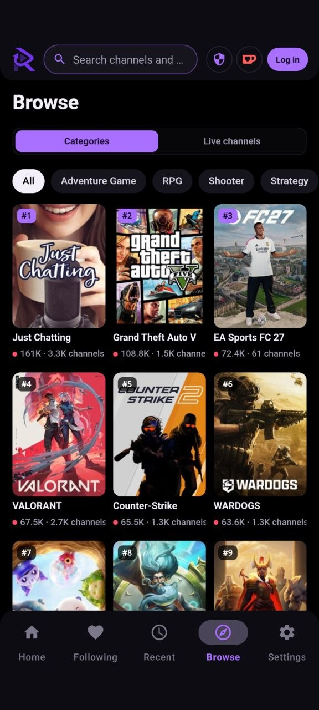
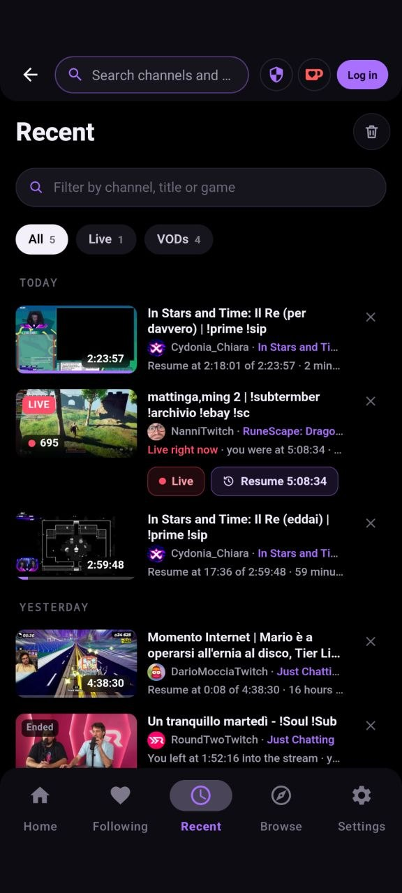
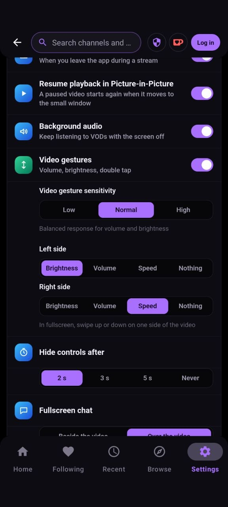
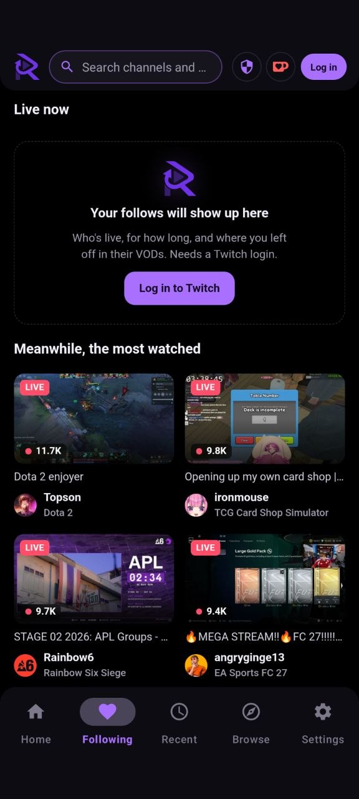
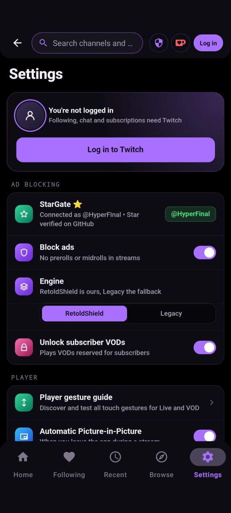
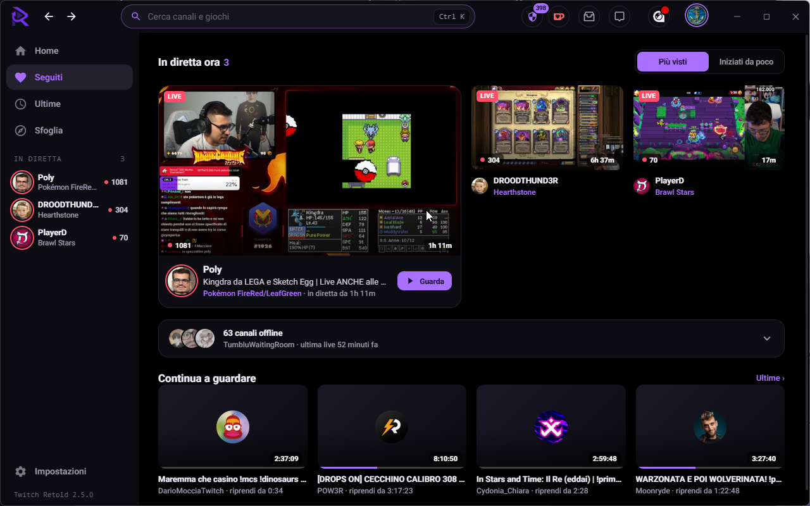
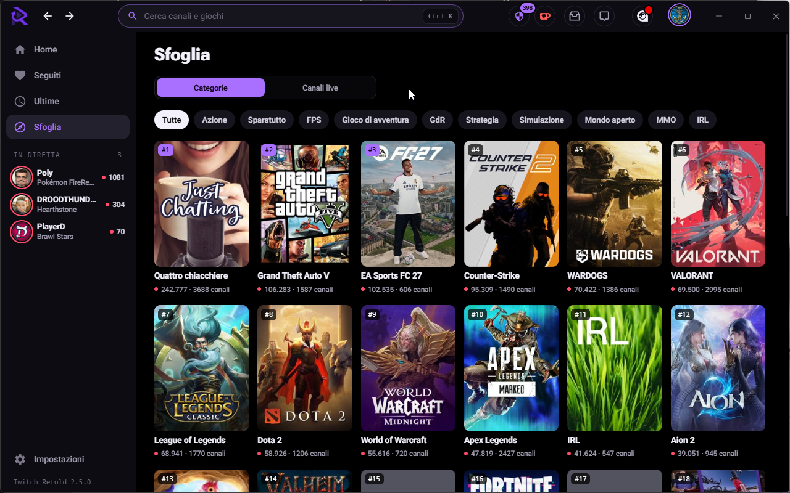
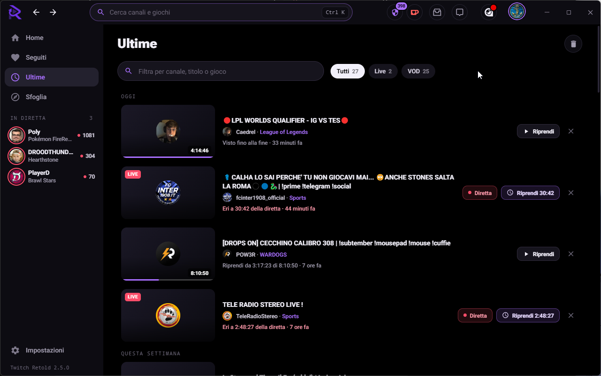
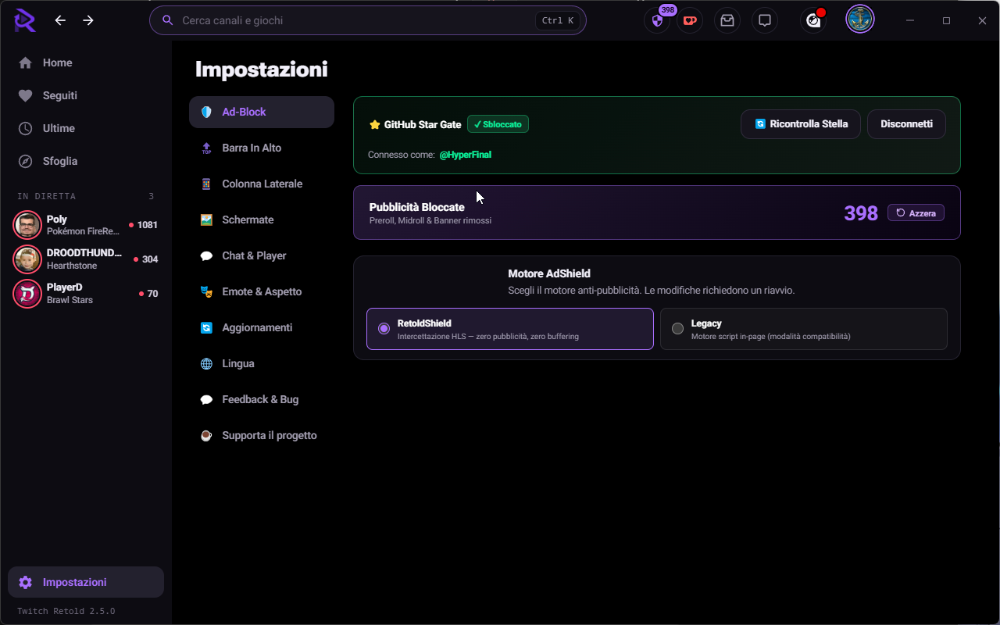

# Twitch Retold

**The Ultimate, Ultra-Clean & Ad-Free Desktop & Mobile Experience for Twitch**

---

  <b>Twitch Retold</b> is a modern, standalone client engineered to provide the cleanest, fastest, and most immersive Twitch viewing experience on Desktop and Android — completely free and ad-free.

[📥 **Download Latest Releases (Windows / Android / macOS / Linux)**](https://github.com/HyperFinal/Twitch-Retold-Desktop-Android/releases) • [📢 **Telegram Channel**](https://t.me/twitch_retold) • [☕ **Support on Ko-fi**](https://ko-fi.com/hyperfinal)

  <a href="#app-preview"><b>📸 Previews</b></a> •
  <a href="#mobile-features"><b>📱 Mobile</b></a> •
  <a href="#retoldshield"><b>🛡️ RetoldShield</b></a> •
  <a href="#benchmark-dataset"><b>📊 Benchmarks</b></a> •
  <a href="#key-features"><b>✨ Features</b></a> •
  <a href="#installation"><b>🚀 Install</b></a> •
  <a href="#shortcuts"><b>⌨️ Shortcuts</b></a> •
  <a href="#virustotal-scans"><b>🧪 VirusTotal</b></a>

---

  
<b>📑 Table of Contents (click to expand)</b>

   

  - [🧪 VirusTotal Scans](#virustotal-scans)
  - [📸 App Preview & Interface](#app-preview)
    - [📱 Android Previews](#android-preview)
    - [🖥️ Desktop Previews](#desktop-preview)
  - [📱 Mobile Features (Android)](#mobile-features)
  - [🛡️ RetoldShield Engine](#retoldshield)
    - [📊 Real-World Benchmark](#benchmark-comparison)
    - [🔬 Benchmark Dataset & Verification](#benchmark-dataset)
    - [⚖️ Performance Comparison Matrix](#performance-matrix)
  - [✨ Key Features & Enhancements](#key-features)
    - [1. RetoldShield Zero-Ad Engine](#feature-retoldshield)
    - [2. Deep Black OLED Theme](#feature-oled)
    - [3. Sub-Only VOD Unlocker](#feature-vod)
    - [4. 7TV, BetterTTV & FrankerFaceZ Emotes](#feature-emotes)
    - [5. Playlist & Series Binge Player](#feature-binge)
    - [6. Watch History & Smart Timestamp Resume](#feature-history)
    - [7. Full Localization & Customization](#feature-settings)
    - [8. Native Auto-Updater](#feature-updater)
  - [🚀 Installation & Getting Started](#installation)
    - [Windows](#install-windows)
    - [Android](#install-android)
    - [macOS](#install-macos)
    - [Linux](#install-linux)
  - [⌨️ Shortcuts & Hotkeys (Desktop)](#shortcuts)
  - [📢 Official Telegram Channel](#telegram-channel)
  - [⭐ Show Your Support](#support)

---

## 🧪 VirusTotal Scans

Every installer is scanned on VirusTotal before it is announced. Twitch Retold is not code-signed, so a few engines may flag it generically: the full reports are public, and the SHA-256 lets you check that your download is the same file.

| Platform | Version | File | Report |
|---|---|---|---|
| 🪟 Windows | v2.5.2 | `Twitch-Retold-Setup-2.5.2.exe` | [🔎 VirusTotal](https://www.virustotal.com/gui/file/8d1754b79825828d2c67f249b4454dd65e882f5ffddc480becde9ba916924c92) |
| 📱 Android | v1.0.1 | `Twitch_retold_1.0.1.apk` | [🔎 VirusTotal](https://www.virustotal.com/gui/file/9ea7b4f5cb53868026e99c24c0d618ff959f346a7dd7368e112853dd8800f7de) |

**SHA-256**
- Windows: `8d1754b79825828d2c67f249b4454dd65e882f5ffddc480becde9ba916924c92`
- Android: `9ea7b4f5cb53868026e99c24c0d618ff959f346a7dd7368e112853dd8800f7de`

---

## 📸 App Preview & Interface

> 👉 **Click any screenshot to open it full size.**

### 📱 Android

<table>
  <tr>
    <td align="center"></td>
    <td align="center"></td>
    <td align="center"></td>
    <td align="center"></td>
    <td align="center"></td>
  </tr>
</table>

### 🖥️ Desktop

<table>
  <tr>
    <td align="center" width="50%"> <b>Home</b></td>
    <td align="center" width="50%"> <b>Browse &amp; Categories</b></td>
  </tr>
  <tr>
    <td align="center" width="50%"> <b>Recent: Lives &amp; VODs</b></td>
    <td align="center" width="50%"> <b>Settings</b></td>
  </tr>
</table>

---

## 📱 Mobile Features (Android)

The native Android app brings the ultra-clean, ad-free Twitch Retold experience straight to your mobile device:

- 🛡️ **Advanced Stream Ad Protection**: Real-time stream ad interception for live streams and VODs powered by RetoldShield.
- 🔓 **Sub-Only VOD Unlocker**: Watch subscriber-locked past broadcasts freely without restrictions.
- 🎭 **Complete Emote Ecosystem**: Native rendering of 7TV, BetterTTV, and FrankerFaceZ animated emotes in live chat.
- 📺 **Native Picture-in-Picture (PiP)**: Keep watching in a floating player while navigating other apps.
- 🎧 **Background Audio & Lockscreen Playback (VODs)**: Keep listening to VODs with your screen off, complete with notification media controls.
- 🌙 **Deep OLED Dark Theme**: Deep black aesthetic tailored for AMOLED and OLED displays.
- 🔄 **Integrated In-App Auto-Updater**: Directly checks, downloads, and prompts installation for new APK releases.
- ⭐ **StarGate 1-Tap Community Unlock**: Effortless GitHub verification via pre-filled Custom Tabs to unlock RetoldShield & Sub-Only VODs.

---

## 🛡️ RetoldShield — The New Standard in Ad-Free Streaming

**Twitch Retold** features **RetoldShield as its default primary built-in engine** on both Desktop and Android.

Unlike traditional adblock proxies that downscale video to **480p/360p** with heavy lag (+500ms), or legacy scripts that suffer from **stream blackouts and buffering loops**, **RetoldShield** delivers **advanced ad interception at native 1080p60 Source resolution without playback interruptions, proxy lag, or forced downscaling, powered by direct Twitch CDN delivery**.

---

### 📊 Real-World Benchmark: RetoldShield vs. Legacy AdBlock vs. PurpleTV

Evaluated across a high-stress dataset recorded directly from live Twitch broadcasts (**9,072 live playlist manifests**, **131,200 video segments**, and **951 server-side ad breaks** across 10 top live channels). Every engine is replayed against the exact same captured manifests, so the comparison is reproducible from the published files:

  

  

  

  

  

---

### Benchmark Dataset & Verification

All benchmarks shown above are measured on live production Twitch streams—not in local mocks, synthetic playlists, or dev environments.

- **Real live streams**: Data was captured directly from active Twitch broadcasts (esports tournaments, high-traffic streamers, IRL channels) and then replayed, byte for byte, through each engine. The comparison dataset covers **9,072 live playlist manifests (`.m3u8`)**, **131,200 video segments**, and **951 real Amazon SSAI ad breaks** (`Amazon|<id>`) from 10 channels. A second, wider dataset covers **1,013 channel entries across 413 channels** and is used to measure what happens in the first seconds after you open a channel.
- **Production builds**: The tested engine is the exact same build shipped in our desktop and mobile releases, connecting to standard Twitch edge CDNs under normal network conditions.
- **No AI / machine learning**: RetoldShield does not use machine learning, neural networks, or heuristic guesses. It operates via deterministic HLS parsing (RFC 8216), segment continuity tracking, and stream alignment.
- **Open dataset**: The complete measurement data, comparison JSONs, and session logs are available in [`benchmark-dataset/`](./benchmark-dataset/). You can inspect the raw `.jsonl` files (ad classes and `#EXT-X-DATERANGE` attributes, timings, per-read verdicts; no account data, no IP addresses, no signed tokens — every capture is anonymous) or open [`benchmark-dataset/benchmarks/viewer.html`](./benchmark-dataset/benchmarks/viewer.html) in your browser to view the benchmark results.
- **What is not covered yet**: these numbers describe ads inserted into the video stream (SSAI). Twitch also delivers ads **client-side**, outside the manifest, and those are not part of this dataset. A wider 27-hour field campaign — engine on/off control blocks, hundreds of channels, client-side ad tracking — has just been completed and its results, including the cases where an ad did get through, will be published here.

### ⚖️ Performance Comparison Matrix

| Metric / Feature | 🛡️ **RetoldShield** *(New Default)* | ⚙️ **Legacy AdBlock** *(In-Page)* | 🌐 **PurpleTV / TTV LOL** *(Proxy — estimated)* | 🔴 **Unprotected Twitch** |
| :--- | :---: | :---: | :---: | :---: |
| **Video Ad Elimination** *(SSAI, this dataset)* | **951/951 ad breaks resolved** | **951/951 ad breaks resolved** | ⚠️ 90–95% *(Ad leaks on handshake)* | 0% *(951 Ads Shown)* |
| **Resolution During Ads** | **Native 1080p60 Source** | **Native 1080p60 Source** | ❌ **Forced 480p/360p Downscale** | 1080p60 *(With Ads)* |
| **Stream Breakages & Stalls** | **0 Disruptions (Flawless)** | ❌ **340 Disruptions** *(173 offline, 167 freezes)* | ❌ **185 Disruptions** *(502 drops & timeout)* | 0 Disruptions |
| **Added Network Latency** | **~0.12 ms (Direct Local Engine)** | ~0.08 ms (Direct Local) | ❌ **+350ms to +600ms (Severe Delay)** | 0 ms |
| **Chat Synchronization** | **100% Real-Time** | 100% Real-Time | ❌ Out-of-sync *(Delayed reactions)* | 100% Real-Time |
| **Server Dependence** | **None (100% Local Engine)** | None (100% Local Engine) | ❌ Vulnerable to proxy outages & bans | Official Twitch CDN |
| **Multi-Window Stress Test** | **101/101 Ads Resolved (0 Stalls)** | High desync risk on multi-window | Bandwidth bottlenecks during peak hours | Constant commercial breaks |

> **How to read this table.** The RetoldShield, Legacy and Unprotected columns come from the published dataset: same captured manifests, same replay, numbers you can recompute from [`benchmark-dataset/`](./benchmark-dataset/). The proxy column is **not measured by us**: it summarises what those projects document and what users report, and it is kept here only as context. Ad elimination refers to server-side ads inserted into the stream; client-side ads are a separate problem, see the note above.

---

## ✨ Key Features & Enhancements

### 🛡️ 1. RetoldShield Zero-Ad Engine
* Built-in by default — silently removes preroll and midroll video ads from the stream.
* Direct CDN connection ensures zero stream buffering, no resolution drops, and real-time chat sync.
* Real-time ad counter with accurate debouncing and 1-click counter reset.

### 🌙 2. Deep Black OLED Theme
* Crafted for OLED and high-contrast IPS displays with pure `#000000` backgrounds and vibrant neon purple accents (`#a970ff`).
* Instant real-time toggle in Settings (<kbd>F2</kbd> on Desktop / Settings dialog on Mobile).

### 🔓 3. Sub-Only VOD Unlocker
* Watch subscriber-locked past broadcasts, highlights, and VODs seamlessly.
* Synchronized chat replay and timestamp navigation preserved.

### 🎭 4. 7TV, BetterTTV & FrankerFaceZ Emotes
* Built-in support for 7TV animated emotes, personal badges, and zero-width emote stacking.
* BetterTTV and FFZ channel emotes render directly inside native Twitch chat.

### 🎬 5. Playlist & Series Binge Player
* Sequential VOD playback with automatic next-episode queuing for series, podcasts, and playthroughs.

### ⏱️ 6. Watch History & Smart Timestamp Resume
* Quick-access "Last Live / VODs" navigation to resume channels from your exact saved position.
* Automatically converts finished live broadcasts into historical VODs.

### ⚙️ 7. Full Localization & Customization
* 100% translated across **6 languages**: English, Italian, French, German, Spanish, and Portuguese.
* Modular toggles: customize titlebar, hide stories, clean sidebar, and adjust layout clutter.

### 🔄 8. Native Auto-Updater
* Periodic background checking with alert toasts when new releases drop.
* Automatic in-app download and installation on both Desktop and Android.

## 🚀 Installation & Getting Started

### 🪟 Windows:
1. Download **`Twitch Retold Setup <version>.exe`** from [Latest Releases](https://github.com/HyperFinal/Twitch-Retold-Desktop-Android/releases).
2. Run the installer. If Windows Defender SmartScreen appears, click **"More info"** and then **"Run anyway"**.

### 📱 Android:
1. Download **`Twitch_retold_<version>.apk`** from the [latest Android release](https://github.com/HyperFinal/Twitch-Retold-Desktop-Android/releases/tag/mobile-v1.0.1).
2. Open the downloaded APK on your Android device and confirm installation. (If prompted, enable *"Install unknown apps"* for your browser or file manager).

### 🍎 macOS:
1. Download **`Twitch.Retold-<version>.dmg`** (Universal: Apple Silicon M1/M2/M3/M4 & Intel).
2. Open the DMG and drag **Twitch Retold** into your **Applications** folder.

### 🐧 Linux:
1. **AppImage** (Universal): Download `Twitch.Retold-<version>.AppImage`, make it executable (`chmod +x Twitch.Retold-*.AppImage`), and launch.
2. **Debian / Ubuntu / Mint**: Download `twitch-retold_*_amd64.deb` and run `sudo dpkg -i twitch-retold_*_amd64.deb`.

## ⌨️ Shortcuts & Hotkeys (Desktop)

| Shortcut | Action |
| :--- | :--- |
| <kbd>F2</kbd> | Open **Twitch Retold Settings** modal |
| <kbd>F5</kbd> | Reload Current Page / Stream |
| <kbd>F11</kbd> | Toggle Fullscreen Mode |

---

## 📢 Official Telegram Channel

Stay instantly informed about new releases, critical hotfixes, and direct installer downloads:

**👉 [https://t.me/twitch_retold](https://t.me/twitch_retold)**

---

## ⭐ Show Your Support

If you find **Twitch Retold** useful, please consider giving this repository a **Star** ⭐ on GitHub and sharing it with friends! It helps more people find the project and motivates ongoing development.

---

## ☕ Support the Project

Twitch Retold is independent and **100% free**. If you appreciate our work and want to support ongoing development:

 

**👉 [https://ko-fi.com/hyperfinal](https://ko-fi.com/hyperfinal)**

 

*Every coffee helps keep Twitch Retold actively updated and ad-free. Thank you! ❤️*

---

Twitch Retold is an independent project and is not affiliated with, endorsed by, or sponsored by Twitch Interactive, Inc. or Amazon.com, Inc.

